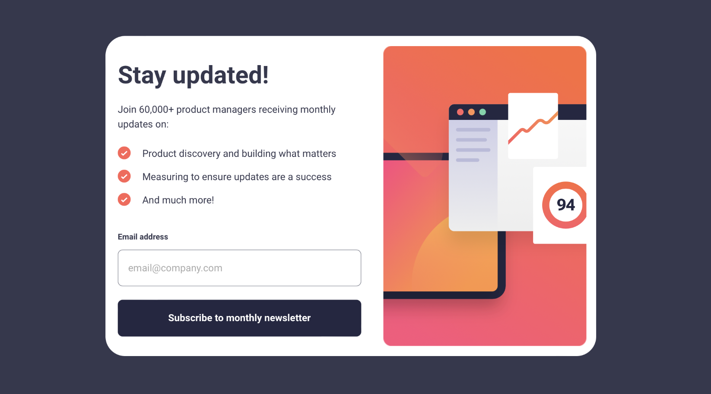
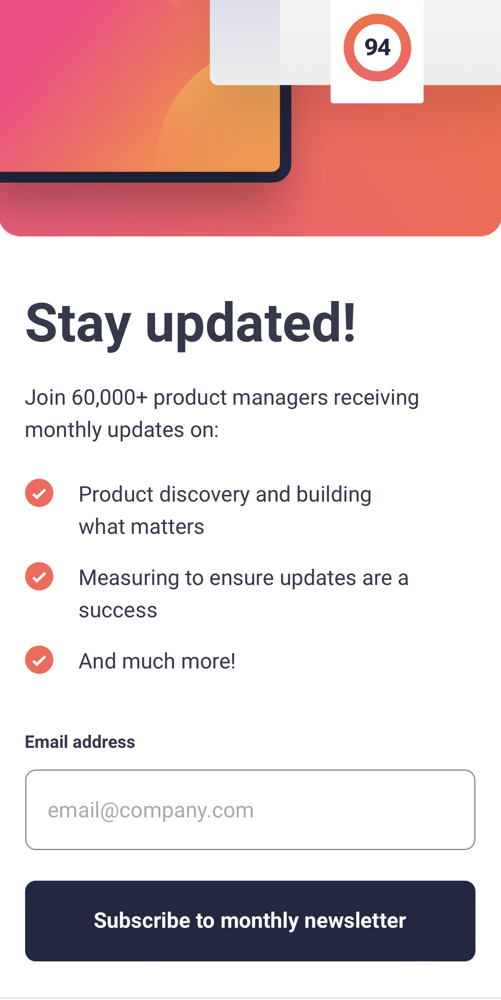

# Frontend Mentor - Newsletter sign-up form with success message solution

This is a solution to
the [Newsletter sign-up form with success message challenge on Frontend Mentor](https://www.frontendmentor.io/challenges/newsletter-signup-form-with-success-message-3FC1AZbNrv).
This is the first thing I've built without a tutorial. I'm pretty happy with it.

## Table of contents

- [Overview](#overview)
    - [The challenge](#the-challenge)
    - [Screenshot](#screenshot)
    - [Links](#links)
- [What I learned](#what-i-learned)
    - [Useful resources](#useful-resources)
- [Acknowledgments](#acknowledgments)

## Overview

### The challenge

Users should be able to:

- Add their email and submit the for
- See a success message with their email after successfully submitting the form
- See form validation messages if:
    - The field is left empty
    - The email address is not formatted correctly
- View the optimal layout for the interface depending on their device's screen size
- See hover and focus states for all interactive elements on the page

### Screenshot




### Links

- Live Site URL: https://charlieprior.github.io/SignUpChallenge/

## What I learned

- That the script needs to be loaded last so it has
  access to the DOM 🤦🏻‍♂️

- How to react to a form submission:
    - I used the submit
      event of the form to validate the input and display the
      success message, and the onblur event to provide feedback to
      the user that their email is incorrectly formatted.
    - The dismiss button uses a simple onclick event to reset
      the form and hide the success message.

```html

<form class="signup__form" id="signup__form">
    <div class="flex-group">
        <label class="email__label" for="signup__input">Email address</label>
        <span class="email__error hidden">Invalid email!</span>
    </div>
    <input class="input" type="email" id="signup__input" name="email" placeholder="email@company.com">
    <button type="submit" class="button">
        Subscribe to monthly newsletter
    </button>
</form>
```

```javascript
const form = document.getElementById("signup__form");
form.addEventListener("submit", subscribeClicked);

const input = document.getElementById("signup__input");
input.onblur = function () { ...
}

const dismiss = document.getElementById("dismiss__button");
dismiss.addEventListener("click", dismissClicked);
}
```

```js
const proudOfThisFunc = () => {
    console.log('🎉')
}
```

- I tried hard to make the HTML and CSS structure
  be logical and easy to understand. I think I succeeded.

### Useful resources

- [HTML Events](https://developer.mozilla.org/en-US/docs/Web/API/HTMLFormElement#events)
- [async defer](https://javascript.info/script-async-defer)

## Acknowledgments

Thanks to the Frontend Mentor community for the help, especially @Josh Burri and @deejayjay on discord for all their
help.
